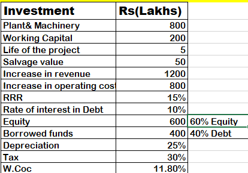

# Financial Modeling Project: Estimation of Cash Flows for XYZ Limited

## Overview
This project evaluates the feasibility of a capital investment project for XYZ Limited by analyzing cash flows using Net Present Value (NPV), Internal Rate of Return (IRR), and Excel tools (Goal Seek, Solver, Scenario Manager, Data Table).

---

## Key Data
- **Plant & Machinery:** 800 lacs
- **Working Capital:** 200 lacs
- **Project Life:** 5 years
- **Salvage Value:** 50 lacs
- **Annual Revenue Increase:** 1200 lacs
- **Annual Operating Cost Increase:** 800 lacs
- **Tax Rate:** 30%
- **Depreciation:** 25% (Written Down Value basis)
- **Equity:** 600 lacs (60%)
- **Debt:** 400 lacs (40%)
- **WACC:** 11.80%

---

## Objectives
1. Compute **Net Profit, NPV, and IRR**.
2. Perform sensitivity analysis using Excel tools.
3. Provide actionable recommendations.

---

## Results Summary
- **Net Profit (Years 1–5):** 112, 147, 173, 193, 208 lacs
- **NPV:** 189.90 lacs
- **IRR:** 20%

### Sensitivity Analysis
- **Scenario Manager:** Modeled changes in operating costs and tax rates.
- **Goal Seek:** Determined revenue needed to achieve Year 5 profit target.

---